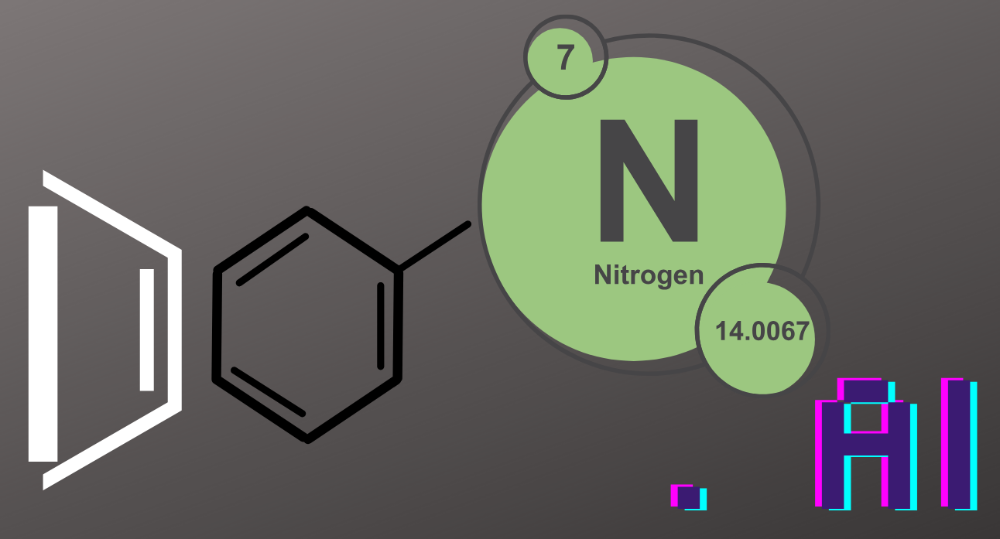

# Don.ai - Creative Design Suite

<div align="center">
  
  
  <h3>AI-Powered Creative Design Application</h3>
  <p>A browser-based creative design suite built with React, TypeScript, and AI-powered features</p>
  <p><strong>Created by:</strong> <a href="https://github.com/ratnakiri">Ratna Kirti</a></p>
  
  [](https://www.typescriptlang.org/)
  [](https://reactjs.org/)
  [](https://vitejs.dev/)
  [](https://tailwindcss.com/)
  [](https://pages.github.com/)
</div>

---

## 📖 Table of Contents

- [Overview](#-overview)
- [Features](#-features)
- [Tech Stack](#-tech-stack)
- [Prerequisites](#-prerequisites)
- [Installation](#-installation)
- [Development](#-development)
- [Project Structure](#-project-structure)
- [Available Scripts](#-available-scripts)
- [Configuration](#-configuration)
- [API Integration](#-api-integration)
- [Deployment](#-deployment)
- [Contributing](#-contributing)
- [Troubleshooting](#-troubleshooting)
- [License](#-license)
- [Author](#-author)

## 🎯 Overview

Don.ai is a modern, browser-based creative design application that rivals Canva and Adobe Creative Suite. Built with cutting-edge web technologies, it offers AI-powered design tools, interactive canvas editing, and a comprehensive suite of creative features.

**🌐 Live Demo**: [https://lovable.dev/projects/aa69d391-4192-4f15-9faa-987c1cc3a71a](https://lovable.dev/projects/aa69d391-4192-4f15-9faa-987c1cc3a71a)
**🚀 GitHub Pages**: [https://ratnakiri.github.io/don-create-code/](https://ratnakiri.github.io/don-create-code/)

### Key Highlights

- 🤖 **AI-Powered**: Integrated Hugging Face Transformers.js for client-side AI features
- 🎨 **Interactive Canvas**: Fabric.js-powered design canvas with professional tools
- ⚡ **High Performance**: Vite + SWC for lightning-fast development and builds
- 📱 **Responsive Design**: Mobile-first approach with Tailwind CSS
- 🎭 **Modern UI**: shadcn/ui components with Radix UI primitives
- 🔒 **Privacy-First**: All AI processing happens client-side
- 🌐 **Easy Deployment**: Optimized for GitHub Pages and modern hosting platforms

## ✨ Features

### 🎨 Design Tools
- **Interactive Canvas Editor**: Professional-grade design canvas with Fabric.js
- **Shape Tools**: Rectangles, circles, polygons, and custom shapes
- **Text Editor**: Rich text editing with multiple fonts and styles
- **Color Picker**: Advanced color selection with RGB, HSL, and hex support
- **Layer Management**: Organize and manipulate design elements

### 🤖 AI-Powered Features
- **Background Removal**: AI-powered background removal using Transformers.js
- **Smart Suggestions**: Intelligent design recommendations
- **Image Enhancement**: Client-side image processing and optimization

### 🛠️ Professional Features
- **Undo/Redo**: Complete history management for all canvas operations
- **Export Options**: Multiple format support (PNG, JPG, SVG, PDF)
- **Template Library**: Pre-designed templates for quick starts
- **Responsive Design**: Works seamlessly across all devices

## 🔧 Tech Stack

### Frontend Core
- **React 18** - Modern React with hooks and concurrent features
- **TypeScript** - Type-safe development with strict configurations
- **Vite** - Next-generation frontend build tool with SWC

### UI & Styling
- **Tailwind CSS** - Utility-first CSS framework
- **shadcn/ui** - High-quality, accessible component library
- **Radix UI** - Unstyled, accessible UI primitives
- **Lucide React** - Beautiful & consistent icons

### Canvas & Graphics
- **Fabric.js** - Powerful HTML5 canvas library for interactive graphics
- **React Router DOM** - Declarative routing for React applications

### AI & Machine Learning
- **Hugging Face Transformers.js** - Client-side machine learning models
- **Browser-based Processing** - No server-side AI dependencies

### State Management & Data
- **React Query (TanStack Query)** - Powerful data synchronization
- **React Hook Form** - Performant forms with minimal re-renders
- **Zod** - TypeScript-first schema validation

### Backend Services
- **Supabase** - Backend-as-a-Service for authentication and data storage
- **Real-time Features** - Live collaboration capabilities

## 📋 Prerequisites

Before you begin, ensure you have the following installed on your system:

- **Node.js** (version 18.0 or higher)
- **npm** (version 8.0 or higher) or **yarn** (version 1.22 or higher)
- **Git** (for version control)

### Verify Installation

```bash
# Check Node.js version
node --version

# Check npm version
npm --version

# Check Git version
git --version
```

### Installing Node.js

If you don't have Node.js installed, we recommend using [nvm](https://github.com/nvm-sh/nvm) for version management:

```bash
# Install nvm (Linux/macOS)
curl -o- https://raw.githubusercontent.com/nvm-sh/nvm/v0.39.0/install.sh | bash

# Install latest LTS Node.js
nvm install --lts
nvm use --lts
```

For Windows users, download from [nodejs.org](https://nodejs.org/) or use [nvm-windows](https://github.com/coreybutler/nvm-windows).

## 🚀 Installation

### Quick Start

```bash
# 1. Clone the repository
git clone https://github.com/ratnatalksdonai/don-create-code.git

# 2. Navigate to project directory
cd don-create-code

# 3. Install dependencies
npm install

# 4. Start development server
npm run dev
```

### Alternative Installation Methods

#### Using Yarn
```bash
# Install dependencies with Yarn
yarn install

# Start development server
yarn dev
```

#### Using pnpm
```bash
# Install dependencies with pnpm
pnpm install

# Start development server
pnpm dev
```

### Environment Setup

1. **Copy environment template** (if applicable):
   ```bash
   cp .env.example .env.local
   ```

2. **Configure environment variables** (edit `.env.local`):
   ```env
   VITE_SUPABASE_URL=your_supabase_url
   VITE_SUPABASE_ANON_KEY=your_supabase_anon_key
   ```

## 💻 Development

### Starting the Development Server

```bash
# Standard development server
npm run dev

# Development server with auto-commit (watches for changes)
npm run dev:auto
```

The application will be available at `http://localhost:5173`

### Development Features

- ⚡ **Hot Module Replacement (HMR)** - Instant updates without page refresh
- 🔧 **TypeScript Support** - Full type checking and IntelliSense
- 🎨 **Tailwind CSS** - Real-time style compilation
- 📊 **ESLint Integration** - Code quality checks
- 🔄 **Auto-commit** - Automatic git commits during development

### Auto-Commit System

The project includes an intelligent auto-commit system:

```bash
# Start development with auto-commit
npm run dev:auto

# Start only auto-commit watcher
npm run auto-commit

# Manual commit with prompts
npm run commit
```

**Auto-commit features:**
- Monitors file changes (excludes node_modules, .git, dist)
- Debounced commits (3-second delay)
- Intelligent commit messages
- Automatic push to remote repository

## 📁 Project Structure

```
don-create-code/
├── 📁 public/                    # Static assets
│   ├── favicon.ico              # App favicon
│   ├── placeholder.svg          # Placeholder images
│   └── 📁 lovable-uploads/      # Uploaded assets
├── 📁 src/                      # Source code
│   ├── 📁 components/           # React components
│   │   ├── 📁 ui/              # shadcn/ui components
│   │   ├── Canvas.tsx          # Main design canvas
│   │   ├── ColorPicker.tsx     # Color selection component
│   │   ├── Header.tsx          # Application header
│   │   └── Toolbar.tsx         # Design tools toolbar
│   ├── 📁 hooks/               # Custom React hooks
│   │   ├── use-mobile.ts       # Mobile device detection
│   │   └── use-toast.ts        # Toast notifications
│   ├── 📁 integrations/        # External service integrations
│   │   └── 📁 supabase/        # Supabase configuration
│   ├── 📁 lib/                 # Utility libraries
│   │   └── utils.ts            # Common utilities
│   ├── 📁 pages/               # Route components
│   │   ├── CanvasEditor.tsx    # Main editor page
│   │   ├── Index.tsx           # Homepage
│   │   └── NotFound.tsx        # 404 page
│   ├── 📁 types/               # TypeScript definitions
│   │   └── canvas.types.ts     # Canvas-related types
│   ├── 📁 utils/               # Utility functions
│   │   └── backgroundRemover.ts # AI background removal
│   ├── App.tsx                 # Main application component
│   ├── main.tsx               # Application entry point
│   └── nav-items.tsx          # Navigation configuration
├── 📁 scripts/                  # Build and development scripts
├── 📁 supabase/                # Supabase configuration
├── package.json               # Project dependencies
├── tsconfig.json             # TypeScript configuration
├── tailwind.config.ts        # Tailwind CSS configuration
├── vite.config.ts           # Vite build configuration
└── README.md                # This file
```

### Key Directories

- **`/src/components`** - Reusable UI components and design elements
- **`/src/pages`** - Route-level components (Homepage, Canvas Editor)
- **`/src/hooks`** - Custom React hooks for shared logic
- **`/src/types`** - TypeScript type definitions
- **`/src/utils`** - Utility functions including AI processing

## 📜 Available Scripts

### Development Scripts
```bash
# Start development server
npm run dev

# Start development with auto-commit
npm run dev:auto

# Run ESLint for code quality
npm run lint
```

### Build Scripts
```bash
# Build for production
npm run build

# Build for development environment
npm run build:dev

# Preview production build locally
npm run preview
```

### Git & Deployment Scripts
```bash
# Auto-commit watcher only
npm run auto-commit

# Manual commit with prompts
npm run commit
```

### Script Details

| Script | Description | Use Case |
|--------|-------------|----------|
| `dev` | Standard development server | Regular development |
| `dev:auto` | Development + auto-commit | Active development with git |
| `build` | Production build | Deployment preparation |
| `build:dev` | Development build | Testing build process |
| `preview` | Preview production build | Pre-deployment testing |
| `lint` | Run ESLint checks | Code quality assurance |
| `auto-commit` | File watcher for commits | Automatic version control |
| `commit` | Interactive commit tool | Manual commit with messages |

## ⚙️ Configuration

### TypeScript Configuration

The project uses strict TypeScript settings in `tsconfig.json`:

```json
{
  "compilerOptions": {
    "strict": true,
    "noUnusedLocals": true,
    "noUnusedParameters": true,
    "exactOptionalPropertyTypes": true
  }
}
```

### Vite Configuration

Key Vite settings in `vite.config.ts`:

```typescript
import { defineConfig } from 'vite'
import react from '@vitejs/plugin-react-swc'

export default defineConfig({
  plugins: [react()],
  resolve: {
    alias: {
      "@": path.resolve(__dirname, "./src"),
    },
  },
})
```

### Tailwind CSS Configuration

Customized design system in `tailwind.config.ts`:

```typescript
module.exports = {
  content: ["./src/**/*.{js,ts,jsx,tsx}"],
  theme: {
    extend: {
      colors: {
        // Custom color palette
      },
    },
  },
  plugins: [require("tailwindcss-animate")],
}
```

### ESLint Configuration

Modern ESLint setup in `eslint.config.js`:

```javascript
import js from '@eslint/js'
import globals from 'globals'
import reactHooks from 'eslint-plugin-react-hooks'
import reactRefresh from 'eslint-plugin-react-refresh'
import tseslint from 'typescript-eslint'

export default tseslint.config(
  { ignores: ['dist'] },
  {
    extends: [js.configs.recommended, ...tseslint.configs.recommended],
    files: ['**/*.{ts,tsx}'],
    languageOptions: {
      ecmaVersion: 2020,
      globals: globals.browser,
    },
    plugins: {
      'react-hooks': reactHooks,
      'react-refresh': reactRefresh,
    },
    rules: {
      ...reactHooks.configs.recommended.rules,
      'react-refresh/only-export-components': [
        'warn',
        { allowConstantExport: true },
      ],
    },
  },
)
```

## 🔗 API Integration

### Supabase Integration

The project integrates with Supabase for backend services:

```typescript
// src/integrations/supabase/client.ts
import { createClient } from '@supabase/supabase-js'

const supabaseUrl = import.meta.env.VITE_SUPABASE_URL
const supabaseAnonKey = import.meta.env.VITE_SUPABASE_ANON_KEY

export const supabase = createClient(supabaseUrl, supabaseAnonKey)
```

### AI Model Integration

Client-side AI processing with Hugging Face:

```typescript
// src/utils/backgroundRemover.ts
import { pipeline } from '@huggingface/transformers'

export const removeBackground = async (imageElement: HTMLImageElement): Promise<Blob> => {
  // AI processing implementation
}
```

### Environment Variables

Required environment variables:

```env
# Supabase Configuration
VITE_SUPABASE_URL=your_supabase_project_url
VITE_SUPABASE_ANON_KEY=your_supabase_anon_key

# Optional: Additional API keys
VITE_CUSTOM_API_KEY=your_custom_api_key
```

## 🚀 Deployment

### ✅ **DEPLOYMENT READY STATUS**

**Current Status: READY FOR PRODUCTION DEPLOYMENT** ✅

| Check | Status | Details |
|-------|---------|---------|
| 🧹 **ESLint** | ✅ PASSED | 0 errors, 0 warnings |
| 🔍 **TypeScript** | ✅ PASSED | 0 compilation errors |
| 🏗️ **Production Build** | ✅ PASSED | 1.45MB bundle generated |
| 📦 **Dependencies** | ✅ PASSED | All packages compatible |
| 🎨 **Canvas Integration** | ✅ PASSED | Fabric.js v6 working |
| 🤖 **AI Features** | ✅ PASSED | Transformers.js ready |

### Quick Deployment Check

Before deploying, run our automated deployment readiness check:

```bash
# For Windows (PowerShell)
npm run deploy-check

# For macOS/Linux (Bash)
npm run deploy-check:bash

# Manual type checking
npm run type-check
```

### Lovable Platform (Recommended)

The easiest way to deploy:

1. Visit [Lovable Project](https://lovable.dev/projects/aa69d391-4192-4f15-9faa-987c1cc3a71a)
2. Click **Share** → **Publish**
3. Your app will be live instantly!

### Custom Domain Setup

To connect a custom domain:

1. Navigate to **Project** → **Settings** → **Domains**
2. Click **Connect Domain**
3. Follow the DNS configuration steps

📖 [Custom Domain Guide](https://docs.lovable.dev/tips-tricks/custom-domain#step-by-step-guide)

### Alternative Deployment Options

#### Vercel
```bash
# Install Vercel CLI
npm i -g vercel

# Deploy
vercel --prod
```

#### Netlify
```bash
# Build the project
npm run build

# Deploy dist/ folder to Netlify
```

#### GitHub Pages (Recommended for Open Source)

We've optimized Don.ai for seamless GitHub Pages deployment:

```bash
# 1. Build and deploy in one command
npm run deploy

# 2. Or deploy with our automated script
npm run deploy:github

# 3. Manual deployment steps
npm run predeploy  # Builds the app
npm run deploy     # Deploys to gh-pages branch
```

**🎯 Live Example**: [https://ratnakiri.github.io/don-create-code/](https://ratnakiri.github.io/don-create-code/)

#### Setup GitHub Pages:

1. **Fork this repository** to your GitHub account
2. **Update repository name** (optional):
   - Go to repository **Settings** → **General**
   - Update repository name if needed
   - Update `base` path in `vite.config.ts` accordingly

3. **Enable GitHub Pages**:
   - Go to repository **Settings** → **Pages**
   - Source: **Deploy from a branch**
   - Branch: **gh-pages** / **(root)**
   - Save the settings

4. **Update configuration** (if using different repo name):
   ```typescript
   // vite.config.ts - Update repository name
   base: mode === 'production' ? '/your-repo-name/' : '/',
   
   // src/App.tsx - Update basename
   const basename = import.meta.env.PROD ? '/your-repo-name' : '';
   ```

5. **Deploy**:
   ```bash
   git clone https://github.com/YOUR_USERNAME/YOUR_REPO_NAME.git
   cd YOUR_REPO_NAME
   npm install
   npm run deploy
   ```

6. **Access your app** at: `https://YOUR_USERNAME.github.io/YOUR_REPO_NAME/`

#### GitHub Pages Features:
- ✅ **SPA Routing**: Configured for React Router
- ✅ **Auto-deployment**: Automated with gh-pages package
- ✅ **Optimized builds**: Production-ready bundles
- ✅ **Custom 404**: Handles client-side routing
- ✅ **SEO Ready**: Proper meta tags and descriptions

## 🤝 Contributing

We welcome contributions to Don.ai! Here's how to get started:

### Development Setup

1. **Fork the repository**
2. **Clone your fork**:
   ```bash
   git clone https://github.com/YOUR_USERNAME/don-create-code.git
   ```
3. **Create a feature branch**:
   ```bash
   git checkout -b feature/amazing-feature
   ```
4. **Make your changes** following our coding guidelines
5. **Test thoroughly**
6. **Commit your changes**:
   ```bash
   git commit -m "feat: add amazing feature"
   ```
7. **Push to your branch**:
   ```bash
   git push origin feature/amazing-feature
   ```
8. **Open a Pull Request**

### Coding Guidelines

- Follow the TypeScript and React patterns in the codebase
- Use meaningful component and function names
- Include JSDoc comments for complex logic
- Maintain test coverage for new features
- Follow the established file structure and naming conventions

### Code Style

- **TypeScript**: Strict mode with proper typing
- **React**: Functional components with hooks
- **Styling**: Tailwind CSS with shadcn/ui components
- **Imports**: Organized (React → Third-party → Internal)

## 🐛 Troubleshooting

### Common Issues

#### Development Server Won't Start

```bash
# Clear npm cache
npm cache clean --force

# Delete node_modules and reinstall
rm -rf node_modules package-lock.json
npm install

# Try alternative ports
npm run dev -- --port 3000
```

#### TypeScript Errors

```bash
# Check TypeScript version
npx tsc --version

# Restart TypeScript server in VS Code
Ctrl+Shift+P → "TypeScript: Restart TS Server"
```

#### Build Failures

```bash
# Clear Vite cache
npx vite build --force

# Check for circular dependencies
npm run lint
```

#### Git Auto-Commit Issues

```bash
# Check git configuration
git config --list

# Verify remote repository
git remote -v

# Test manual push
git push origin main
```

### Fabric.js TypeScript Issues

#### Problem: Module '"fabric"' has no exported member 'fabric'
This occurs due to version mismatch between Fabric.js v6+ and older TypeScript definitions.

**Solution:**
1. Remove incompatible TypeScript definitions:
   ```bash
   npm uninstall @types/fabric
   ```

2. Use proper imports for Fabric.js v6:
   ```typescript
   // Correct import for Fabric.js v6
   import { Canvas as FabricCanvas, Rect, Circle, Text, Image as FabricImage } from "fabric";
   
   // Use TypeScript's any type for Fabric objects
   const [fabricCanvas, setFabricCanvas] = useState<any>(null);
   ```

3. Add TypeScript comment to suppress import warnings:
   ```typescript
   // eslint-disable-next-line @typescript-eslint/ban-ts-comment
   // @ts-ignore - Fabric.js v6 doesn't have proper TypeScript definitions yet
   import { Canvas as FabricCanvas } from "fabric";
   ```

### Performance Issues

#### Large Bundle Size
- Check for unused dependencies
- Implement code splitting
- Optimize images and assets

#### Slow Canvas Performance
- Reduce complex shapes on canvas
- Implement object pooling
- Use debounced operations

### Browser Compatibility

Don.ai supports modern browsers with ES2020+ features:
- ✅ Chrome 88+
- ✅ Firefox 78+
- ✅ Safari 14+
- ✅ Edge 88+

### Getting Help

- 📖 Check the [Lovable Documentation](https://docs.lovable.dev/)
- 💬 Join our community discussions
- 🐛 Report bugs via GitHub Issues
- 📧 Contact support for urgent issues

## 📄 License

This project is licensed under the MIT License. See the [LICENSE](LICENSE) file for details.

## 👨‍💻 Author

<div align="center">
  
  **Ratna Kirti**
  
  *Full-Stack Developer & AI Enthusiast*
  
  [](https://github.com/ratnakiri)
  [](https://linkedin.com/in/ratnakiri)
  [](https://ratnakiri.dev)
  
  📧 **Contact**: [ratna.kirti@gmail.com](mailto:ratna.kirti@gmail.com)
</div>

### About the Developer

Ratna Kirti is a passionate full-stack developer with expertise in:
- 🚀 **Frontend**: React, TypeScript, Next.js, Vue.js
- 🔧 **Backend**: Node.js, Python, Express, FastAPI
- 🤖 **AI/ML**: Hugging Face, TensorFlow, PyTorch
- ☁️ **Cloud**: AWS, Vercel, Netlify, GitHub Actions
- 🎨 **Design**: Canvas APIs, SVG manipulation, Creative tools

Don.ai Creative Suite represents a culmination of modern web technologies and AI integration, designed to democratize creative design tools for everyone.

### Project Inspiration

> "I believe that creativity should be accessible to everyone. Don.ai is my contribution to making professional-grade design tools available in the browser, powered by AI and built with modern web technologies." - Ratna Kirti

---

<div align="center">
  <h3>🎨 Start Creating with Don.ai Today!</h3>
  <p>Built with ❤️ by <a href="https://github.com/ratnakiri">Ratna Kirti</a></p>
  
  [🚀 Live Demo](https://lovable.dev/projects/aa69d391-4192-4f15-9faa-987c1cc3a71a) • 
  [🌐 GitHub Pages](https://ratnakiri.github.io/don-create-code/) • 
  [📖 Documentation](https://docs.lovable.dev/) • 
  [🐛 Report Issues](https://github.com/ratnakiri/don-create-code/issues)
</div>
